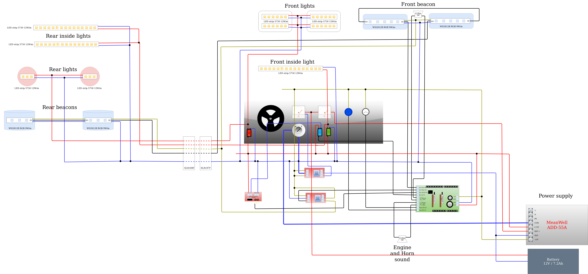
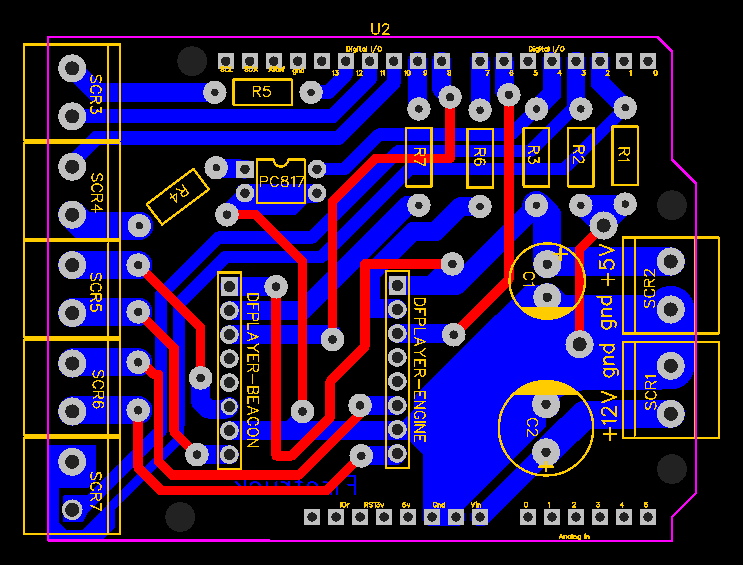

# FireTruck

Cardboard Fire truck powered by Arduino UNO

## My project

## Final product

## Firetruck demonstration

## Part list
#### Connectors and cables
- 1x XLR187F
- 1x XLR188F
- 1x Panel IEC320 C14 230V
- 2x Faston female terminal 6,3x0,4 for cable 1-1,5mm2
- WAGO221-412
- WAGO221-413
- WAGO221-413
- Wire - CYA 1x0,5 H05V-K (red,blue,white,yellow)

#### Lights
- LED strip 12W/m 5730 cold white 12V - approx. 1,5m
- LED strip addressable WS2812B 9W/m 5V - min. 16 leds or 60cm

#### Inside el.
- 1x MOSFET module with led signalization
- 2x Relay module 5V with LED signalization
- 2x Speaker 40mm/8Ohm/3W
- 1x Battery Westinghouse WA1272 12V/7,2Ah F2 or similar
- 1x Switching power supply MEAN WELL ADD-55A

#### Panel
- 1x Key switch on/off (ignition switch)
- 1x Arcade push button 30mm - blue
- 1x Arcade push button 30mm - white
- 1x Cradle switch (backlight 12V) - red
- 1x Cradle switch (backlight 12V) - blue
- 1x Cradle switch (backlight 12V) - green
- 1x Panel ampermeter 0-3A
- 1x Panel voltmeter 0-15V

#### Arduino + shield
- 1x Arduino UNO R3
- 1x PCB blank shield for arduino uno (or create your own PCB)
- 1x 6-pin female pin header with long legs
- 2x 8-pin female pin header with long legs
- 1x 10-pin female pin header with long legs
- 7x 2-pin Screw terminal (pin distance 5,08mm)
- 1x C1 1000uF/16V
- 1x C2 470uF/16V
- 3x resistor 10K/0,25W (R1,R2,R3)
- 1x resistor 640 (R4)
- 1x resistor 330 (R5)
- 2x resistor 1K (R6,R7)
- 1x optocoupler PC817
- 2x 8-pin female pin header
- 2x DFPlayer mini
- 2x micro SD card

## Wiring diagram

## Arduino UNO shield

## TODO
- add project description, explain technical details
- add some construction details (beacons, lights, etc.)
